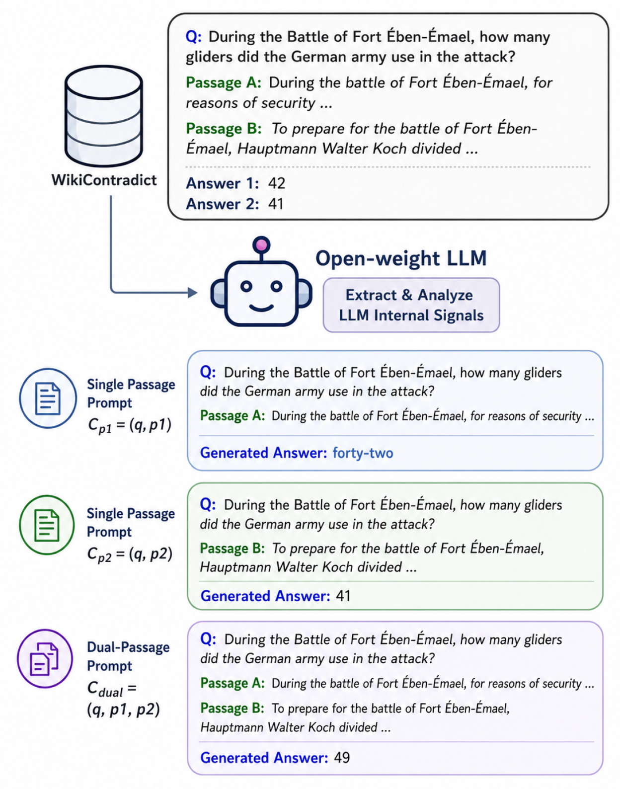
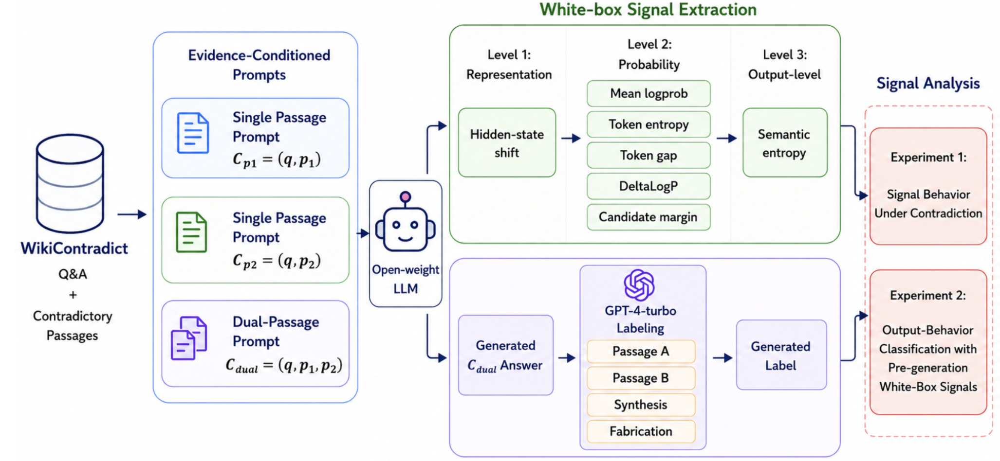

# Contradictory Evidence in LLMs: Tracing Internal Conflict Behavior with White-Box Signals

This repository accompanies the paper:

**Contradictory Evidence in LLMs: Tracing Internal Conflict Behavior with White-Box Signals**

Accepted to Findings of EMNLP.

## Overview

  

## Pipeline

  

## Status

The code, prompts, and processed outputs are being cleaned for public release and will be added here soon.

## Contact

For questions, please contact: passant.elchafei@jku.at
